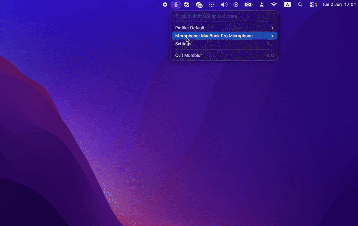

# Mumblur

**Local push-to-talk dictation for macOS.** Hold Right Option, speak, release — your words appear at the cursor. Audio never leaves your machine; an optional local LLM cleans up filler words and punctuation; corrections you make on past transcripts are fed back as few-shot examples so the model gradually learns how you actually speak.

No telemetry. No cloud. No account. Just a menu-bar icon and a hotkey.

[](https://github.com/taiseii/mumblur/actions/workflows/test.yml)
[](LICENSE)



---

## Features

- **On-device transcription** via [WhisperKit](https://github.com/argmaxinc/argmax-oss-swift). Pick any model from the OpenAI Whisper family or drop in your own CoreML model (Settings → Models supports both Hugging Face repos and on-disk folders).
- **Optional LLM cleanup**, talking to any **OpenAI-compatible local server** (llama.cpp, Ollama, LM Studio, etc.). One global toggle in Settings → AI Editing; configurable base URL, model, timeout, max-tokens, temperature, extra body JSON, and request template (Mode 2) for non-OpenAI shapes.
- **Personalization that actually learns from you.** Every dictation is saved with both raw Whisper output and final post-processed text. You can open any past transcript and edit a "Correction" field with your intended phrasing; up to 10 of the most recent `(raw → corrected)` pairs are injected as few-shot examples into the next LLM edit prompt, so the cleanup drifts toward your style without any retraining.
- **Multiple profiles**, each with its own model, language, initial vocabulary prompt, and regex/literal **replacement rules** that run after the LLM stage (your hard-coded substitutions always win).
- **Per-language decoding** — pick a fixed language (English, German, Japanese, …) or auto-detect, per profile.
- **Microphone selection from the menu bar.** Enumerates Core Audio devices and routes the engine's input by stable UID, so re-plugged USB mics rebind correctly; unplugged devices silently fall back to system default.
- **Transcript history & search** in Settings → Data: every dictation, with raw and corrected text shown side by side, plus storage stats and "Reveal in Finder".
- **Optional audio retention** with day-based or count-based caps. Off by default — text-only mode keeps zero audio.
- **GRDB-backed SQLite** persistence in `~/Library/Application Support/Mumblur/mumblur.sqlite`. Open it with any SQLite browser; the schema is migrated cleanly across versions.
- **Privacy by default**: zero outbound network calls unless *you* configure an LLM server, in which case it's still localhost. No analytics, crash reporters, or update pings.

## Install

### Option 1 — download the binary

1. Grab the latest `Mumblur.zip` from [Releases](https://github.com/taiseii/mumblur/releases).
2. Unzip and drag `Mumblur.app` to `/Applications`.
3. The build is ad-hoc-signed (no Apple Developer Program), so macOS Gatekeeper will block it on first launch. Remove the quarantine attribute once:
   ```bash
   xattr -dr com.apple.quarantine /Applications/Mumblur.app
   open /Applications/Mumblur.app
   ```
   Or right-click → Open → "Open" in the dialog. After the first launch macOS remembers it.

### Option 2 — build from source

```bash
brew install xcodegen
xcodegen generate
scripts/build_app.sh --install
open /Applications/Mumblur.app
```

Requirements: macOS 14 (Sonoma)+, Apple Silicon recommended, Xcode 16+, ~1 GB free for the default WhisperKit model.

## First-launch permissions

Mumblur asks for three TCC grants. The 2-second permission re-check timer picks them up automatically — no restart needed.

1. **Microphone** — capture audio.
2. **Accessibility** — synthesize ⌘V at the cursor.
3. **Input Monitoring** — detect the Right Option hotkey globally.

## Usage

Hold **Right Option**, dictate, release. Within ~1 second the transcript appears at the cursor.

Menu-bar icon states:

| Icon | State |
|---|---|
| `mic` | idle, waiting |
| `mic.fill` (red) | recording |
| `waveform` | transcribing |
| `hourglass` | loading model |
| `exclamationmark.triangle` | permission needed |
| `exclamationmark.octagon` | fatal error |

The menu bar also exposes Profile and Microphone submenus for quick switching.

## LLM editing & personalization

1. Run any OpenAI-compatible chat-completion server locally (llama.cpp, Ollama, LM Studio, …). Tiny non-thinking instruct models work best — for "fix punctuation, remove fillers" you want fast tokens, not chain-of-thought.
2. **Settings → AI Editing**: tick **Enable LLM editing**, paste the base URL (e.g. `http://127.0.0.1:8080/v1/chat/completions`), set the model name. Hit **Test connection** — it'll round-trip a one-line probe.
3. (Optional) **Extra body JSON** is merged into every request. Useful for vendor knobs like `{"chat_template_kwargs": {"enable_thinking": false}}` on Qwen3.
4. Dictate. The transcript is edited by the LLM (fail-open: if the call times out or errors, you get the raw Whisper text instead).
5. Open **Settings → Data**, pick a past dictation, fill the **Correction** field with what you *meant* to say, and Save. Clearing the field discards the correction. Saved corrections feed the next dictation's prompt as few-shot `(Raw → Corrected)` examples, so the editor learns your style over time. No retraining, no upload — it's just prompt augmentation against your local model.

## Where your data lives

Everything is under `~/Library/Application Support/Mumblur/`:

- `mumblur.sqlite` — profiles, transcripts, corrections, retention policy, settings (SQLite via GRDB).
- `clips/` — optional WAV audio, only present if retention is enabled.
- `models/` — WhisperKit models on first download.

You can wipe state by deleting the folder.

## Privacy

Mumblur is local-first by design. There is no cloud service, no account, no telemetry endpoint. Outbound network calls happen only in two situations, both initiated by you:

- **Model download** — first time WhisperKit fetches a model (from Hugging Face, by config).
- **LLM cleanup** — only if you've enabled LLM editing and pointed it at a server.

If you enable LLM editing, the **base prompt + recent corrections + the current dictation** are sent to *your* configured server. Keep that in mind if you're correcting sensitive transcripts — the corrected text gets replayed into future prompts as a few-shot example.

## Architecture

| Layer | Where | Notes |
|---|---|---|
| Menu-bar UI, settings panes, view models | `App/` | SwiftUI 6.0, `@MainActor` |
| Audio capture, hotkey, transcribe, LLM edit, paste, persist | `MumblurCore/Sources/MumblurCore/` | A standalone Swift package, fully testable |
| WhisperKit integration | `Transcriber.swift` | 30 s padding, prompt-token biasing |
| OpenAI-compatible LLM client | `LLMEditor.swift` | Mode 1 (merge into canonical body) or Mode 2 (full template). Hard timeout race, fail-open |
| Few-shot personalization | `FewShot.swift` | Pure formatter + `TranscriptStoreFewShot` adapter that filters no-op pairs |
| SQLite storage (GRDB) | `MumblurCore/Sources/MumblurCore/Storage/` | Versioned migrations (v1, v2, v3) |

## Development

```bash
# Generate the Xcode project (only after editing project.yml)
xcodegen generate

# Run the package test suite (145+ tests, fast)
cd MumblurCore && swift test

# The slow WhisperKit integration test (downloads a model first time, ~3 min)
cd MumblurCore && MUMBLUR_RUN_SLOW=1 swift test --filter WhisperKitSpikeTests

# Stream the app's logs while you test
log stream --predicate 'subsystem == "world.questable.mumblur"' --info --debug
```

Tests are strict TDD across the codebase: writes follow red → green → refactor, and `.notice`-level logs are added at major pipeline gates so failures are diagnosable from `log show` without re-instrumenting.

See [CONTRIBUTING.md](CONTRIBUTING.md) for layout, branch naming, commit style, and review etiquette.

## Roadmap

- Notarized release via Apple Developer Program so the quarantine-remove step goes away.
- Whisper LoRA fine-tuning path consuming the `(audio → corrected)` pairs already being captured.
- Diversity-aware few-shot selection (currently newest-N).
- Live mic-change during a recording (today: applied on next press).
- Linux build? Maybe — WhisperKit is CoreML-only, so a different STT backend would be needed.

## License

MIT — see [LICENSE](LICENSE).
